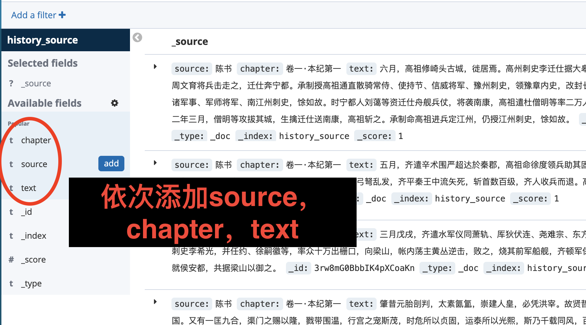
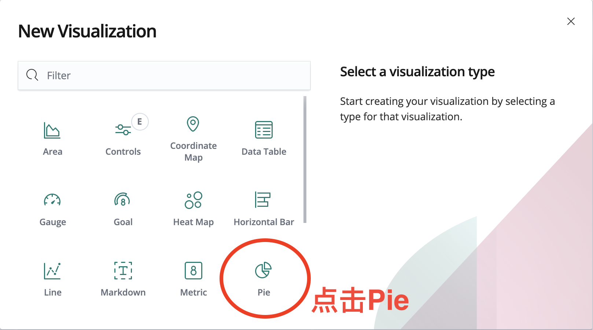
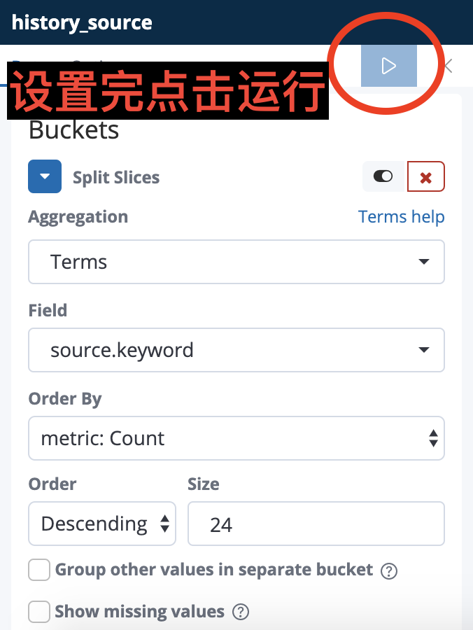
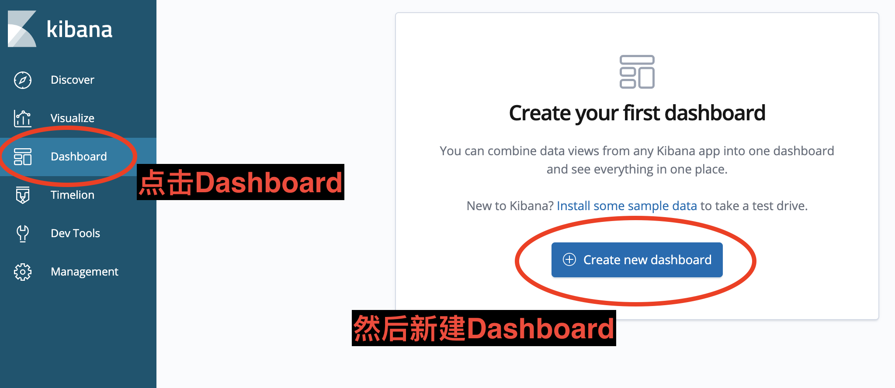
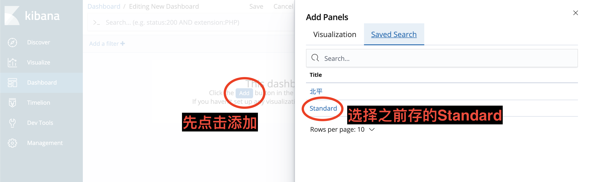
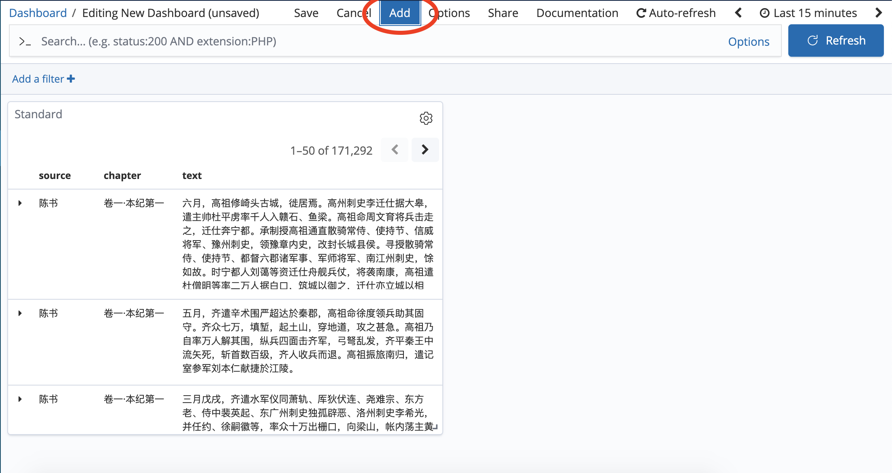
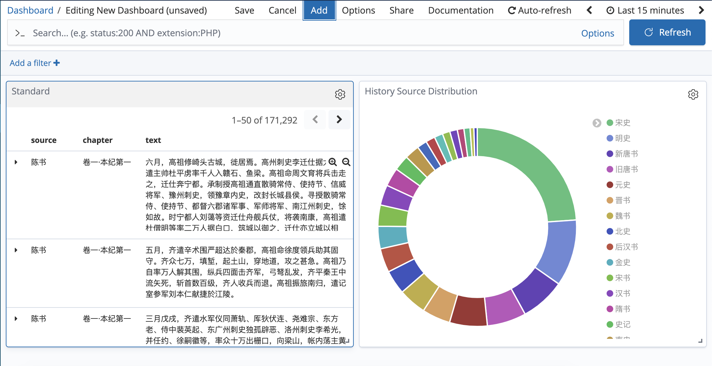
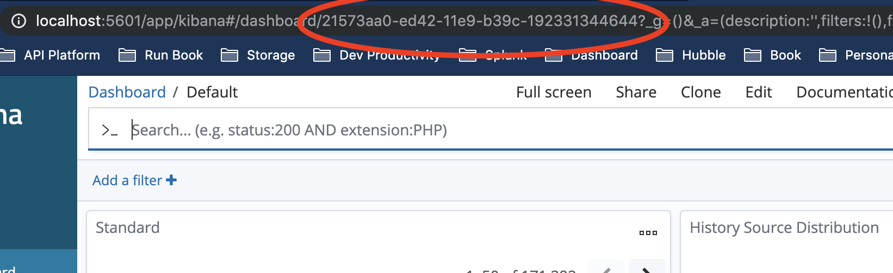

# ChineseHistoricalSource
This is my personal stash of Chinese Historical Source

声明：这是个个人项目，不要用于商业用途。

# 项目Demo

网址：http://hakusan-s.com:5601/

个人不推荐用这个网站，因为服务器是自己Host的，非常不稳定。

建议您用自己的电脑Host这个服务器。

# 安装方法
1. 安装Ruby和bundle：
```
brew install ruby
gem install bundle
```
2. 把我的repo clone下来：
```
git clone git@github.com:quzhi1/ChineseHistoricalSource.git
```
3. 安装并启动ElasticSearch：
```
brew install elasticsearch
brew services start elasticsearch
```
5. 安装并启动Kibana：
```
brew install kibana
brew services start kibana
```
6. 把史料存到ElasticSearch里（可能会有些慢）：
```
cd ChineseHistoricalSource
bundle install
ruby ruby/es_feeder.rb
```
7. 用浏览器打开http://localhost:5601 你会发现以下界面，点击Discover。

8. 在Discover里，依次添加source，chapter，text，chapter_url，和translation。

9. 右上角保存，命名为Standard。

10. 点击Visualize。

11. 点击Create a visualization，选择Pie。

12. 选择From a Saved Search下面的Standard，然后点击Split Slices。

13. Aggregation选Terms，Field选source.keyword，Order By选metric: Count，Order选Decreasing，Size选24。

14. 都选完了点运行。然后就可以看到二十四史的分布了。

15. 别忘保存，起名叫History Source Distribution。

16. 点击Dashboard。

17. 添加之前存的Standard。

18. 再添加之前存的History Source Distribution。


19. 现在你可以看到一个很不错的Dashboard了，别忘了保存，起名叫Default。如果你不满意的话，可以调整大小和布局。


20. 找到浏览器地址栏，把/和?之间的Dashboard ID存下来（比如开个记事本什么的）。

21. 打开这个文件：/usr/local/etc/kibana/kibana.yml，找到#kibana.defaultAppId这一行，把引号里的值改成你之前存的Dashboard ID，比如dashboard/21573aa0-ed42-11e9-b39c-192331344644。然后把这行前面的#删掉。

22. 重启Kibana：`brew services restart kibana`。 如果用的是Docker，`docker ps`一下，找到container id，然后`docker restart <container_id>`。

如果你想把url变得clickable，可以用[field formatter](https://stackoverflow.com/questions/34301271/how-to-display-a-url-as-a-clickable-link-in-kibana-4-discovery)

安装完成了！你可以去localhost:5601浏览你的Dashboard。祝你玩得愉快。

# 用Docker安装ElasticSearch
1. cd ChineseHistoricalSource
2. docker-compose up
3. bundle install
4. ruby ruby/es_feeder.rb

如果想要Cleanup：
1. docker stop $(docker ps -a -q)
2. docker rm $(docker ps -a -q)

# 项目目的

我一直想用做一个史料查询系统，这样的话就能像用Google一样搜索二十四史了。

但是，目前在线能找到的各种史料大概只有txt和pdf版本，这两种都不是标准化数据，不能喂到索引系统里面。

史料的文白对照不在本项目的范畴里。如果需要文白对照，我个人推荐一个移动应用"读典籍"：https://dudianji.com/mobile/。还有一个是国学网：https://duguoxue.com/ershisishi/。

史料的电子化被别人弄得差不多了，我的项目就是想把电子史料标准化。

# 项目内容

这个小项目就是把txt版本的史料做两个操作：
1. 把不同汉字编码的史料标准化成utf8版本。
2. 把utf8版本的txt史料变成统一json格式

所以内容主要是三个：
1. 原始数据。
这个数据来源是"猪猪书网"：http://www.zzs5.com/txt/7871.html
（如有侵权请联系作者，我务必在第一时间删除）
2. 转码数据。
它是把上面的数据做成utf8格式的。
我用了一个在线工具"Subtitle Tools": https://subtitletools.com/convert-text-files-to-utf8-online
如果有史料上的不准确，我会在转码数据里改，而不会去改原始数据。
转码数据我也会做一下格式上的预处理。
3. json数据。这个数据就是可以放到索引系统里的标准化数据
4. 标准化算法。我用Ruby写一些Script，把utf8格式的txt史料parse成json。

这个过程后来发现并不高效，于是后来我采用抓取国学网（https://duguoxue.com/ershisishi/）的方法生成json文件。

# json格式
目前支持三个Attribute：史料、章节和原文。原文的每一句话都是一个json object。
范例：
```json
{
    "source": "史记",
    "chapter": "陈涉世家",
    "text": "陈胜者，阳城人也，字涉。",
    "chapter_url": "https://duguoxue.com/ershisishi/2607.html",
    "translation": "https://duguoxue.com/ershisishi/2722.html"
}
```
有时候translation找不到对应章节，网址就是白话版史书的目录。

# 工程笔记

## GCP Instance Setup

今天的云服务各种各样，但因为吸引的客户是企业而不是个人，所以没有多少是免费的。如果想免费只有两个办法，一种是短期试用。短期试用虽然自由，但难以持久。一种是长期但受限制。
限制的方法有限制容量和限制待机时间。
长期免费但受限制的服务我找到的只有两个：Heroku和Google Cloud Platform（GCP）。

Heroku目前不能做一个通用的Instance，只能做Application。我记得Heroku有一个免费的PostgreSQL，但有一个很紧的数量限制：10,000行。对于史料来说，这远远不够。
另一个原因是我本人不是很熟悉用SQL做索引系统，所以还是选择ElasticSearch。Heroku有一个ElasticSearch的Application，但不是免费的，所以只能放弃Heroku了。

GCP的选择就很多了。谷歌这个平台比较开放，support也很多。因为GCP基本就是谷歌版本的AWS，所以主打的业务就是通用的计算单元。AWS的计算单元叫EC2，谷歌叫Compute Engine。

谷歌虽然说是免费，但是把免费的方法藏得很深。稍有不慎就被谷歌收钱了。Medium有一篇文章讲了一下如何把Instance搞成免费的：https://medium.com/@hbmy289/how-to-set-up-a-free-micro-vps-on-google-cloud-platform-bddee893ac09
简单来说就是，机子的类型必须是f1-micro VPS，区域必须是us-central1 (Iowa), us-east1 (South Carolina)或者us-west1 (Oregon)。磁盘容量可以调成30G。

谷歌的ssh比AWS人性化多了，直接用浏览器当Terminal，非常爽。不像AWS，还要搞一个Private Key File

## 安装ElasticSearch
我用的操作系统是Debian，所以安装ElasticSearch需要下列Command（https://www.elastic.co/guide/en/elasticsearch/reference/current/deb.html）

```bash
wget -qO - https://artifacts.elastic.co/GPG-KEY-elasticsearch | sudo apt-key add -
sudo apt-get install apt-transport-https
echo "deb https://artifacts.elastic.co/packages/7.x/apt stable main" | sudo tee -a /etc/apt/sources.list.d/elastic-7.x.list
sudo apt-get update && sudo apt-get install elasticsearch
```

然后就是启动了。用`ps -p 1`查启动方式。我试了两次，第一次查出来是systemd，于是

```bash
sudo systemctl start elasticsearch.service # 启动
sudo systemctl stop elasticsearch.service # 关闭
sudo journalctl -f # Tail log
```

第二次竟然变了，变成init，于是

```bash
sudo update-rc.d elasticsearch defaults 95 10 # 设成自动启动
sudo -i service elasticsearch start # 启动
sudo -i service elasticsearch stop # 关闭
```

顺便说一下，我2014年也搞过一个ElasticSearch的个人项目，启动方式当年是类似`elasticsearch server start`。当时大版本号好像是3，现在都是7了。
这几年ElasticSearch变化快，用之前建议查一下变没变。

## ElasticSearch 网络设置
经过了各种找，发现ElasticSearch的Configuration在这里(https://www.elastic.co/guide/en/elasticsearch/reference/current/settings.html)
```
/etc/elasticsearch/elasticsearch.yml
```
然后要把network host改成GCP的Internal IP

## ElasticSearch内存设置
GCP的免费Tier只有0.6GB的内存（不给力啊老湿），而ElasticSearch的默认设置是1GB或者2GB，非常土豪。所以需要调一下JVM的设置。(https://www.elastic.co/guide/en/elasticsearch/reference/current/jvm-options.html)

```
/etc/elasticsearch/jvm.options
```

设置一下-Xmx和-Xms，都搞成300m，主要前面不要有空格。

## GCP的弃坑

GCP的免费版内存实在太小了，就算是把Heap Size变小，还是会让Instance直接死掉。我现在想先试试在Mac上搞一个Demo版本，以后估计真的要**众筹**买AWS、GCP、Heroku或者Bonsai了。


## Mac上安装ElasticSearch

经过GCP的折磨以后，本地Mac上安装就非常爽了：

```bash
brew install elasticsearch
brew services start elasticsearch # Background service running
elasticsearch # Test in shell
brew install kibana
brew services start kibana # Background service running
kibana # Test in shell
```

Elasticsearch默认port是9200，Kibana默认port是5601

Log和Config什么的可以在这儿找：https://www.elastic.co/guide/en/elasticsearch/reference/current/brew.html

## 史记
史记这个txt比较整齐，从第五行开始是正文（为了方便我直接把前四行手工删了），所有章节都以"●卷XXX第XXX"开始。

为了以后便于搜索，章节名称我做一下简化。忽略卷目和章节数，直接写章节名称。比如，"●卷一·五帝本纪第一"，简化为"五帝本纪"。

史记包括太史公自序一共130篇，不是很长。

需要注意的是，这个txt换行并不是一句话的终点。也就是说，虽然换行了，但这句话还没完。所以不能通过换行来做分界。
如果分段的话，我可以用中文的分段标记，也就是前面空两格。（也就是四个拉丁字母空格）

## 汉书
汉书末尾有一些关于汉书的介绍，还有目录，不应该做索引，所以删去。

汉书这个史料格式比较奇怪，它每一章是一行，然后用空格分行。

卷十一以后的章节名都是乱码，我手工给改过来了。

汉书里的表就不索引了，系文倒是可以索引，有兴趣的同学可以来这里查：https://ctext.org/han-shu/

班固把王莽放到那么靠后，估计是故意的吧。

发现“律历志第一下”里面空格乱加。我不熟悉“统母”、“五步”这类的术语，只能当做独立的一段了。

第一章这几个字“卷一上  高帝纪第一上”有一个找不到的特殊字符""，我不知道怎么把它搞掉。最简单的一个Hack就是加一个空行，然后把出来的json的第一个元素删掉。

章节还是把第XX上和第XX下合一下吧，不然可视性太差。

## 后汉书

后汉书这个史料注解太多了，虽然对理解史料有帮助，但对索引系统不友好。好在所有的注都是以“注【XXX】”开头。

我找到了另一个格式的后汉书电子版：http://www.gdwxmz.com/txt/shishu/houhanshu.html

虽然是章节顺序是乱的，但格式非常工整，每一行都是一段，也可以用正则表达式来找出章节名称。

每一个章节底下会重复一下章节名，

这个版本有一个问题，还是乱码，比如“贼帅常山人张燕，轻勇EC39捷”。“矫”字就成了乱码。我就先不一个一个改了，以后可以找一个更好的电子版。

这个电子版还夹杂广告，有八次“本电子书由《中国古典文学名著(www.gdwxmz.com)_古代小说下载_电子书txt在线阅读》（www.gdwxmz.com）整理并提供下载，本站只提供好看的小说txt电子书下载！”需要删掉。

关于内容，有这么个问题：《续汉书》八志（律历、礼仪、祭祀、天文、五行、郡国、百官、舆服）是后来司马彪续上的，所以章节名的格式就不一样了。为了兼容这个，我统一把格式变成“.*第.*”。

其余的就跟汉书的办法一样了。

跟汉书一样，章节里面有特殊字符。正则表达式不要用^和$

有些章节下面一两行有些重复，需要手工删掉。

## 三国志

三国志这个史料虽然有注解，但是是裴松之的，我个人认为裴松之的注史学价值非常高，不应该删掉。因此，所有注解的位置和内容都按原文的标准索引。

突然发现后面的史料一下子就没有注了，这不统一，应该找新的电子版。

找到了一个乱序版，虽然有乱码，但至少可以读。可惜没有裴松之的注了：http://www.gdwxmz.com/txt/shishu/sanguozhi.html

这个版本和上面后汉书那个格式简直一模一样，毕竟同一个源。这样工作就简单多了。

孙坚那一章标题错了：“孙破虏讨逆传弟一”，“弟”应为“第”。不要辜负文台兄。

## 晋书

晋书这个源乱码比较少。章节名称是两行，所以需要改一下代码。让人再次抓狂的是，第二行开始又出现了看不到的特殊字符，需要手工改。

需要把中文空格改成英文，不然不统一。

## 宋书

宋书和晋书一样，略。

## 南齐书

格式和宋书一样，略。

## 梁书

梁书竟然没有，需要这个资源：http://www.gdwxmz.com/txt/shishu/liangshu.html

这个资源处理方法和后汉书一样。

## 陈书

终于到了吕思勉先生的偶像陈武帝陈霸先了！耶！

格式和南齐书一样，略。

## 魏书

我发现http://www.gdwxmz.com 因为没有向国家备案，于是被阿里云关了服务器。摔！

找到了一个白话文的版本：https://www.bhzw.cc/info/9738.html，并没有卵用。

魏书的作者魏收字伯起，这个字我喜欢。

发现了另一个源：https://www.bhzw.cc/info/6103.html。这个是编码不是utf8，而且是繁体，需要转换一下。

没想到我有生之年真的会用到hao123：http://www.hao123.com/haoserver/jianfanzh.htm

有时候一章分成两行写，需要编辑一下。

卷四章节名少个个字，“帝纪第四 世祖纪下  宗纪”，应该是“帝纪第四 世祖纪下  恭宗纪  ”

## 北齐书

北齐书这个格式根本不能Parse，我找一下别的源。

这个源（https://www.aixdzs.com/d/14/14879/#download）虽然像史记，但每段不空两格，parse起来还是有些困难。

这个源（https://www.bhzw.cc/info/6069.html）看起来不错，需要转码utf8。我发现章节数少了，卷三十一到卷五十都没有。需要新的源。

发现这个源（http://www.guoxue.com/shibu/24shi/beiqishu/beiqiml.htm）很有意思。虽然没有全文txt，但是结构非常清晰，而且没有乱码。

国学网的史料很全，而且是标准化的。需要写一个web crawler。可以试一下，或许能够修复之前的乱码问题。这个发现很激动人心。我或许不需要二十四本书一本一本地搞了。从此以后写一个web crawler就能解决所有问题。

国学网里北齐书竟然有些链接是无效的，摔！

## 新思路

自从上次北齐书的问题出现以后，我开始考虑用新思路解决这个问题。不要去下载txt然后自己parse，而是找网上已经有的二十四史网页结构。

txt格式不统一，而且有乱码。而网上已有的二十四史结构统一，而且乱码问题基本解决了。

有几个源可以参考：

国学网：http://www.gxbd.com/ 这个源不建议采用，有些链接失效了。

中学生读书网：https://www.fox2008.cn/ebook/24sjqsg/aindex.htm 这个源不建议采用，它html不规范，编码是gb2312，很难parse。

读国学网：https://duguoxue.com/ershisishi/ 

读国学网槽点比较少，暂且用这个。

## 从新开始的工程笔记

史记缺了“万石张叔列传”，好在我之前的json有这一章，可以手工补上。

写完了！泪目！

## 测试

ElasticSearch有Rate Limit，是12。我认为是concurrent request不能超过12。我加了个Thread Pool，解决。

写个了post function test：

陈书 ingestion is sucessful

宋书 ingestion is sucessful

隋书 ingestion is sucessful

旧五代史 ingestion is sucessful

宋史 ingestion is sucessful

梁书 ingestion is sucessful

金史 ingestion is sucessful

辽史 ingestion is sucessful

旧唐书 ingestion is sucessful

魏书 ingestion is sucessful

新五代史 ingestion is sucessful

晋书 ingestion is sucessful

南史 ingestion is sucessful

北史 ingestion is sucessful

新唐书 ingestion is sucessful

南齐书 ingestion is sucessful

后汉书 ingestion is sucessful

汉书 ingestion is sucessful

明史 ingestion is sucessful

元史 ingestion is sucessful

三国志 ingestion is sucessful

周书 ingestion is sucessful

北齐书 ingestion is sucessful

史记 ingestion is sucessful

干杯🍻

## 二期工程的开始

一期工程有一个致命问题，就是Kibana的权限控制。现在，任何访问网站的人，都可以删掉任何人的Dashboard，删掉Search，删掉Visualization。

这是个悲剧。一个人不小心在网站上修改删除，所有用户都用不了这个网站了。

解决方法看起来很简单。Kibana有个Plugin叫做x-pack，这个东西可以控制访问权限。我只需要安装x-pack就行了。

官方网站上说，x-pack是在ElasticSearch和Kibana免费版的全家桶里的。可是我找了半天没有找到。

这是为什么呢？因为我安装的是oss distribution。这是一个特殊的package，因为历史原因，这个distribution的ES和Kibana版本比较老。

安装官方版本需要先brew tap一下，然后安装elasticsearch-full。而oss distribution只需要brew install elasticsearch。

我公司的电脑不让tap人家elastic公司的东西，我只能用个人电脑试了一下。安装倒是没啥问题，但ElasticSearch启动不了。

这是为什么呢？（X2）

因为ElasticSearch是运行在JVM上的。于是我brew cask install java。可ElasticSearch竟然还是启动不了，JVM加载不上去。

WTF？

后来查了一下，发现是java的version不对。最新版本的java是13，而ElasticSearch唯独不支持13。我看了一眼支持的版本，发现大多数版本的ElasticSearch都支持java8。

那好办，我用了五年的Java，这点小事算不上什么（flag满满）。只要卸载java13，安装java8就可以了。

然而，可能是因为我太老了吧，brew竟然不支持安装java8了。

我陷入了深思。

我发现我本来是想用一个Web Application，结果花了这么多时间在调环境。等等，这个状况怎么那么熟悉？很久以前，程序员哪怕只想写一个服务，也要在configure library上花费大量时间。可为什么今天不这样了呢？

因为一个伟大的发明：**Docker**

## 二十四史搜索的Dockerization

Docker hub上有ElasticSearch和Kibana的image，是基于CentOS的。我写了个简单的docker-compose文件，一键启动一个Docker。

进入Docker用
```
docker ps # Find the contain id
docker exec -it <container_id> /bin/bash # Replace <container_id>
```

然后设置密码
```
bin/elasticsearch-setup-passwords interactive
```

我参考了这个blog：http://codingfundas.com/setting-up-elasticsearch-6-8-with-kibana-and-x-pack-security-enabled/index.html

还有官方指南：https://www.elastic.co/guide/en/elasticsearch/reference/7.4/get-started-built-in-users.html

## Read only user setup

Follow https://www.elastic.co/blog/kibana-dashboard-only-mode

## 三期工程
上次做这个项目离现在已经将近一年了，我自己查史料的时候经常用这个网站，总体来说比较满意（除了比较慢以外）。我发现有几个可以提升的地方。
1. 产品功能：在查询的时候，有时候我想知道前后文，还想看看译文。查询系统要是有这两个的链接就好了。
2. 代码整洁：这个代码库还可以加上robocop做lint，还可以加上sorbet做type checking。

## 原文链接和翻译
原文链接好做，翻译需要加一个hash，而且有时候缺翻译（“史记·秦始皇本纪”没有翻译），有时候章节名对不上。

缺翻译的现象非常多，章节名也差异很大，原文往往是“志第二”，而译文就成了“XX志”。

只能这么做了，如果翻译找不到，那就fall back到全书翻译的页面。至少比没有翻译强。

## robocop和sorbet
robocop只要是用vs code就可以自动检查，但过去没有加上.rubocop.yaml这个文件，我加了几个白名单。

sorbet是我所在的公司开发的产品，可以给ruby做type check。可以按照这个教程做setup：[https://sorbet.org/docs/adopting](https://sorbet.org/docs/adopting)

## 孟章先生的服务器

IP
120.27.235.200 (public)
172.16.161.152 (private)

CentOS download docker: 

Don't follow this https://docs.docker.com/engine/install/centos/

This machine is CentOS 6.5

https://www.linuxidc.com/Linux/2014-11/109107.htm (Can't install)

https://www.liquidweb.com/kb/how-to-install-docker-on-centos-6/ (Can't install)

https://www.securewebcloud.com/cloud/install-docker-on-centos-l-cendck-00/

Install Ruby:

http://mmclub.github.io/blog/2014/03/30/install-ruby-on-rails-on-centos/ (Can't do)

https://tecadmin.net/install-ruby-latest-stable-centos/

Install ElasticSearch

https://www.elastic.co/guide/en/elasticsearch/reference/current/rpm.html

用init

Install Kibana

https://www.elastic.co/guide/en/kibana/current/rpm.html

开放9200和5601端口

https://help.aliyun.com/knowledge_detail/41319.html

我最后干脆把iptables给关了


可是为什么需要安装JDK呢？

https://blog.csdn.net/yang958554999/article/details/105334505

装上Java也没用

ElasticSearch config path

/etc/elasticsearch/elasticsearch.yml

Error: Number of thread too low

https://www.elastic.co/guide/en/elasticsearch/reference/master/max-number-of-threads.html

Error: the default discovery settings are unsuitable for production use

https://discuss.elastic.co/t/problems-with-access-to-elasticsearch-form-outside-machine/172450/3

哈哈哈哈ElasticSearch终于可以用外网访问啦！

就剩Kibana了

Kibana在调完kibana.yml之后也可以访问了

但是我发现ElasticSearch挂了，而且基本上一启动就挂。我仔细看了一下，发现内存使用率竟然已经100%了！

我们需要调一下JVM的Heap Size

https://www.elastic.co/guide/en/elasticsearch/reference/current/heap-size.html

Heap Size不能超过50%。(/etc/elasticsearch/jvm.options)，我调到了300M才终于可以。

终于work了，最后我们来设置密码：
/usr/share/elasticsearch/bin/elasticsearch-setup-passwords interactive

https://www.server-world.info/en/note?os=CentOS_7&p=elasticstack7&f=12

这个API可以看Users
http://120.27.235.200:9200/_security/user

我觉得应该用Kibana System User

记一下：
ElasticSearch config: /etc/elasticsearch/elasticsearch.yml
Kibana config: /etc/kibana/kibana.yml
JVM config: /etc/elasticsearch/jvm.options

superuser: elastic
kibana: kibana_system

我成功搞了Guest用户，用API做的，但是现在看不见data，估计是Role设置的问题。

https://www.elastic.co/guide/en/kibana/current/role-management-api-put.html

我用API建了一个read_only role，建了一个guest user。现在已经大功告成了。我要存一下config。
